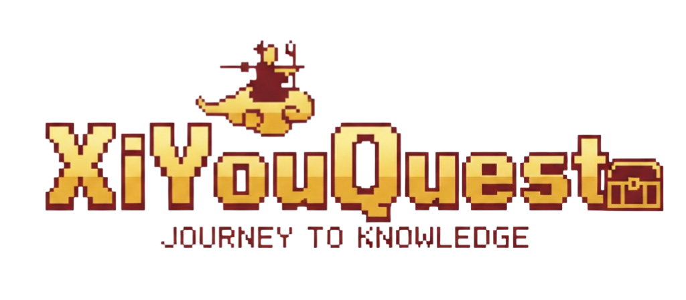

<h1 align="center">
  <br>
  
  <br>
  XiYouQuest — 西游Quest
  <br>
</h1>

<h3 align="center">
  AI-Powered Putonghua Proficiency Test Companion
</h3>

<p align="center">
  <em>Master the PSC exam through pronunciation battles, AI feedback, and a Journey to the West RPG adventure.</em>
</p>

<p align="center">
  
  
  
  
  
  
  
  
</p>

<p align="center">
  Built for the <strong>HKUST GenAI Hackathon</strong>
</p>

---

## Table of Contents

- [Overview](#overview)
- [Features](#features)
- [Architecture](#architecture)
- [Practice Components](#practice-components)
  - [C1: Monosyllabic Characters](#c1-monosyllabic-characters-读单音节字词)
  - [C2: Multisyllabic Words](#c2-multisyllabic-words-读多音节词语)
  - [C3: Vocabulary & Grammar](#c3-vocabulary--grammar-judgment-选择判断)
  - [C4: Passage Reading](#c4-passage-reading-朗读短文)
  - [C5: Prompted Speaking](#c5-prompted-speaking-命题说话)
  - [C6: Cantonese Mistakes Drill](#c6-cantonese-mistakes-drill-易错字词练习)
  - [C7: Polyphonic Characters Quiz](#c7-polyphonic-characters-quiz-多音字练习)
  - [Mock Exam](#mock-exam-full-psc-simulation)
- [Main Quest RPG](#main-quest-rpg)
- [Achievements](#achievements)
- [Speech Evaluation Engine](#speech-evaluation-engine)
- [Text-to-Speech System](#text-to-speech-system)
- [AI Feedback Pipeline](#ai-feedback-pipeline)
- [Gamification System](#gamification-system)
- [Social & Leaderboard](#social--leaderboard)
- [Character Companion System](#character-companion-system)
- [Authentication & Security](#authentication--security)
- [Network Resilience](#network-resilience)
- [Tech Stack](#tech-stack)
- [Getting Started](#getting-started)
- [Project Structure](#project-structure)
- [API Reference](#api-reference)
- [Database Schema](#database-schema)
- [License](#license)

---

## Overview

XiYouQuest transforms Putonghua Proficiency Test (PSC / 普通话水平测试) preparation into a gamified, AI-driven adventure. Inspired by the classic Chinese novel *Journey to the West*, players travel alongside Sun Wukong and companions through a 7-stage RPG campaign — defeating bosses with their pronunciation skills while mastering all 5 official PSC exam components.

Every practice session flows through a multi-service pipeline:

```
🎙️ Record → 📦 WAV Encode → 🌐 iFlytek ISE → 📊 XML Parse → 🤖 Gemini Feedback → 🎮 XP Award → 🏆 Achievement Check
```

---

## Features

| Feature | Description |
|---------|-------------|
| **7 Practice Components** | All 5 official PSC components + 2 supplementary drills (Cantonese mistakes, polyphonic characters) |
| **Main Quest RPG** | 7-stage Journey to the West campaign with turn-based pronunciation battles against mythical bosses |
| **Real-time Speech Scoring** | Phone-level accuracy, tone analysis, fluency metrics via iFlytek Intelligent Speech Evaluation |
| **AI Companions** | 4 Journey to the West characters with unique personalities, expressions, and voice lines |
| **Gemini Feedback** | Character-personalized, context-aware study tips powered by Google Gemini 2.0 Flash |
| **Full Mock Exam** | Timed 5-component simulation with official PSC grade mapping (一级甲等 → 三级乙等) |
| **TTS Playback** | Native Putonghua model audio for every word, sentence, and passage via iFlytek TTS |
| **31 Achievements** | 4-tier achievement system (Common/Uncommon/Rare/Epic) with toast notifications and friend activity feed |
| **XP & Levels** | 10-tier progression from Beginner to PSC God with streak multipliers and daily bonuses |
| **Character Affection** | Build bonds with companions across 5 affection levels by practicing together |
| **Social System** | Friends, friend codes (PSC-XXXX), leaderboards, Discord friend suggestions |
| **Pixel-Art UI** | Press Start 2P fonts, vermilion Chinese-ink motifs, pixel borders, retro battle animations |

---

## Architecture

```
┌─────────────────────────────────────────────────────────────────────┐
│                          BROWSER (Client)                          │
│                                                                     │
│  ┌──────────┐  ┌──────────────┐  ┌───────────┐  ┌───────────────┐  │
│  │ Practice  │  │ AudioRecorder│  │ Quest RPG │  │   Quiz/Exam   │  │
│  │ Session   │  │ (PCM 16kHz)  │  │ Battles   │  │   Sessions    │  │
│  └─────┬─────┘  └──────┬───────┘  └─────┬─────┘  └──────┬────────┘  │
│        │               │                │               │           │
│        └───────────────┼────────────────┼───────────────┘           │
│                        │ WAV Blob       │ Battle State              │
│                        ▼                ▼                            │
├─────────────────── Next.js 16 API Routes ─────────────────────────┤
│                                                                     │
│  ┌──────────────┐ ┌─────────────┐ ┌─────────────┐ ┌─────────────┐  │
│  │ /speech/     │ │ /tts/       │ │ /ai/        │ │ /progress/  │  │
│  │  assess      │ │  speak      │ │  feedback   │ │  update     │  │
│  │  c5-assess   │ │  companion  │ │             │ │             │  │
│  └──────┬───────┘ └──────┬──────┘ └──────┬──────┘ └──────┬──────┘  │
│         │                │               │               │          │
│  ┌──────────────┐ ┌─────────────┐ ┌─────────────┐ ┌─────────────┐  │
│  │ /quest/      │ │ /achieve-   │ │ /social/    │ │ /leader-    │  │
│  │  progress    │ │  ments/     │ │  9 endpoints│ │  board      │  │
│  └──────┬───────┘ └──────┬──────┘ └──────┬──────┘ └──────┬──────┘  │
│         │                │               │               │          │
├─────────┼────────────────┼───────────────┼───────────────┼──────────┤
│         ▼                ▼               ▼               ▼          │
│  ┌─────────────┐  ┌─────────────┐ ┌───────────┐  ┌────────────┐   │
│  │ iFlytek ISE │  │ iFlytek TTS │ │  Google   │  │  Supabase  │   │
│  │  + IST      │  │  WebSocket  │ │  Gemini   │  │ PostgreSQL │   │
│  │ (wss://)    │  │ (wss://)    │ │ 2.0 Flash │  │  + RLS     │   │
│  └─────────────┘  └─────────────┘ └───────────┘  └────────────┘   │
│                                                                     │
│       HMAC-SHA256 Auth         Retry + Backoff    Row Level Sec.   │
└─────────────────────────────────────────────────────────────────────┘
```

---

## Practice Components

### C1: Monosyllabic Characters (读单音节字词)

Practice individual Chinese character pronunciation with per-character tone and accuracy analysis.

```
Server: fetch 50 chars from question_banks → shuffle → pass to PracticeSession

Client (PracticeSession):
  Split into groups of 10 → display as clickable grid

  For each group:
  1. 👆 Tap character → POST /api/tts/speak → iFlytek TTS → WAV cached
  2. 🎙️ Record → getUserMedia(16kHz) → ScriptProcessor → Float32 chunks
  3. ⏹️ Stop → encodeWAV(16kHz, 16-bit, mono) → Blob
  4. 📡 POST /api/speech/assess { category: "read_syllable" }
     → iFlytek ISE WebSocket → SSB + AUW frames → base64 XML
     → Parse per-word accuracy, tone, dp_message, perr_msg
  5. 🎯 Score matching: filter insertions/omissions → sequential word match
  6. 🤖 POST /api/ai/feedback → Gemini personality-driven feedback
  7. ✨ XP: ≥90→10, ≥60→5, <60→2 × streak multiplier

  After final group → POST /api/progress/update → achievement check
```

### C2: Multisyllabic Words (读多音节词语)

Same architecture as C1 with key differences:

| Aspect | C1 | C2 |
|--------|----|----|
| Questions | Single characters (读, 写, 听) | Compound words (经济, 幸福, 蝴蝶) |
| ISE Category | `read_syllable` | `read_word` |
| XML Parsing | Per-syllable scores | `<word total_score>` with syllable breakdown |
| Tone Analysis | Single tone per character | Multi-tone per word (weighted average) |

### C3: Vocabulary & Grammar Judgment (选择判断)

Multiple-choice quiz testing vocabulary accuracy and grammatical judgment — no audio recording.

| Type | Format | Example |
|------|--------|---------|
| **word-choice** (词语判断) | Pick the standard Putonghua form | 垃圾 vs 拉圾 |
| **measure-word** (量词搭配) | Choose the correct measure word | 一___书 → 本/个/条/只 |
| **sentence-order** (语序判断) | Select the grammatically correct sentence | Reordered sentence options |

5 questions per type = 15 total. Answer positions randomized via `useMemo`. Correct → 10 XP + static explanation. Wrong → 2 XP + Gemini-generated explanation.

### C4: Passage Reading (朗读短文)

Read a full Chinese passage aloud with sentence-by-sentence scoring.

```
Phase 1 — SELECT: Choose passage from grid (30 passages with images)
Phase 2 — READY: Interactive passage with per-sentence TTS playback
Phase 3 — RECORD: Full passage recording via AudioRecorder
Phase 4 — ASSESS: ISE read_chapter → sentence-level scores + word detail
Phase 5 — FEEDBACK: Color-coded sentences (green ≥80, yellow ≥60, red <60)
         → Gemini feedback → companion dialogue → progress update
```

### C5: Prompted Speaking (命题说话)

The most complex component — a 3-minute timed free-speaking exercise assessed by a 3-step pipeline.

```
Step 1: ASR Transcription (iFlytek IST WebSocket)
  → PCM chunks → real-time segment assembly → raw transcript

Step 2: Parallel Assessment (Promise.all)
  ├── ISE Pronunciation (read_chapter, auto-chunked if >90s)
  └── Gemini Content Analysis (vocabularyLevel, fluencyLevel, contentRelevance)

Step 3: calculateC5Score() — Official PSC rubric (30 pts → normalized 0-100)
  ├── Pronunciation (20 pts): error count + dialect detection
  ├── Vocabulary/Grammar (5 pts): Gemini level 1-3
  ├── Fluency (5 pts): 3-tier ISE/Gemini fallback
  └── Time penalty: -1/sec under 3 minutes
```

### C6: Cantonese Mistakes Drill (易错字词练习)

Supplementary pronunciation drill for common Cantonese-speaker errors:

| Category | Chinese | What it Drills |
|----------|---------|----------------|
| **zhcs** | 平翘舌音 | z/c/s vs zh/ch/sh confusion |
| **nng** | 前后鼻音 | -n vs -ng final confusion |
| **ln** | 边鼻音 | l vs n initial confusion |

2 groups x 5 words x 3 categories = 30 words across 6 rounds. Uses ISE `read_word` category.

### C7: Polyphonic Characters Quiz (多音字练习)

Supplementary MCQ testing polyphonic characters (多音字) — characters with multiple valid pronunciations. Reuses C3 `QuizSession`. Questions show sentences with the target character **highlighted**; options are pinyin readings. 15 questions per session.

### Mock Exam: Full PSC Simulation

Timed, sequential assessment of all 5 official components:

| Component | Time Limit | Weight | Method |
|-----------|-----------|--------|--------|
| C1 Monosyllabic | 3:30 | 10% | ISE `read_syllable` |
| C2 Multisyllabic | 2:30 | 20% | ISE `read_word` |
| C3 Judgment | 3:00 | 10% | Local quiz scoring |
| C4 Passage | 4:00 | 30% | ISE `read_chapter` |
| C5 Speaking | 3:00 | 30% | 3-step C5 pipeline |

**PSC Grade Mapping:**

| Score | Grade | Chinese |
|-------|-------|---------|
| 97+ | First Class, Grade A | 一级甲等 |
| 92-96 | First Class, Grade B | 一级乙等 |
| 87-91 | Second Class, Grade A | 二级甲等 |
| 80-86 | Second Class, Grade B | 二级乙等 |
| 70-79 | Third Class, Grade A | 三级甲等 |
| 60-69 | Third Class, Grade B | 三级乙等 |
| <60 | Below Standard | 不达标 |

---

## Main Quest RPG

A 7-stage story campaign themed after Journey to the West (西游记), where players defeat mythical bosses through pronunciation accuracy.

### The Journey

| Stage | Name | Boss | Character Unlock |
|-------|------|------|-----------------|
| 1 | Prologue (序章) | Demon King of Turmoil (混乱魔王) | — (Sun Wukong is default) |
| 2 | River of Shattered Tone (碎调之河) | Water Spirit (水灵) | Tang Sanzang (三藏) |
| 3 | Desert of Illusion (幻影沙漠) | Lady of Bleached Bones (白骨夫人) | Sha Wujing (沙悟净) |
| 4 | Moonlit Mountain (月影山) | Moonfang Wolf Demon (月牙狼魔) | — |
| 5 | Misty Bamboo Forest (迷雾竹林) | Bull Demon King (牛魔王) | — |
| 6 | Plains of Fading Echoes (余音平原) | Heavenly Guardian (天庭守护者) | Zhu Bajie (猪八戒) |
| 7 | Western Palace (西天宫殿) | Twisted Sun Wukong (扭曲悟空) | — |

### Battle System

```
┌─── Turn Structure ─────────────────────────────────────────────┐
│                                                                 │
│  PLAYER TURN                                                    │
│    ├── Menu: Attack / Skip                                      │
│    ├── Record pronunciation (word group, max 5 per recording)   │
│    ├── ISE assess → score ≥ 80 = HIT (boss takes damage)       │
│    └── Score < 80 = MISS (no damage)                            │
│                                                                 │
│  ENEMY TURN                                                     │
│    ├── Boss narration (3 thematic lines per stage, random)      │
│    ├── MCQ question with countdown timer                        │
│    │     Stages 1-4: 15 seconds                                 │
│    │     Stages 5-7: 12 seconds                                 │
│    ├── Correct = "BLOCKED!" (no damage)                         │
│    └── Wrong/timeout = player loses 1 HP                        │
│                                                                 │
│  Repeat until boss HP = 0 (victory) or player HP = 0 (defeat)  │
└─────────────────────────────────────────────────────────────────┘
```

**Player HP:** Base 3 + 2 per unlocked companion (max 9 with all 3 companions)
**Boss HP:** 100 (visual), damaged by `ceil(100 / totalRecordingGroups)` per hit
**XP Reward:** `mcqCorrect * 5 + round(avgPronScore / 10) * totalRecordings + stage * 10`

### Visual Components

- **Stage Select**: SVG world map with animated paths, locked/cleared/available node states
- **Battle Arena**: Full-screen backgrounds, party sprite lineup, boss with float animation
- **Attack Animation**: Wukong 3-frame dash toward boss with trail glow effects
- **Damage Numbers**: Floating damage text with fade-out animation
- **Turn Banners**: Cinematic "PLAYER TURN" / "ENEMY TURN" slide-in banners

---

## Achievements

31 achievements across 4 tiers, tracked via event-driven checks at 6 trigger points.

### Tiers

| Tier | Color | Count | Examples |
|------|-------|-------|---------|
| Common | Bronze | 4 | First Steps, Honorable Defeat, Fellow Traveler, Trial by Fire |
| Uncommon | Silver | 11 | Stage 1-7 Cleared, Character Apprentice (5 sessions) x4 |
| Rare | Gold | 11 | Stage 1-7 Flawless (no damage), Character Adept (10 sessions) x4 |
| Epic | Purple | 5 | Journey Complete (all 7 stages), Character Master (20 sessions) x4 |

### Trigger Points

| Event | Where | Achievements Checked |
|-------|-------|---------------------|
| `account_created` | OAuth callback | First Steps |
| `quest_clear` | Quest progress API | Stage cleared, flawless, all stages, character unlocks |
| `quest_fail` | Quest progress API | Honorable Defeat |
| `session_complete` | Progress update API | Character bond milestones (5/10/20 sessions) |
| `friend_added` | Social respond API | Fellow Traveler |
| `mock_exam_complete` | Mock exam API | Trial by Fire |

### Achievement Page

- Completion summary bar: `X / 31 (Y%)`
- Per-tier breakdown with colored badges
- Filterable grid (All / Common / Uncommon / Rare / Epic)
- Locked achievements shown dimmed with descriptions still visible
- Friend activity feed showing last 20 achievement unlocks across your network

---

## Speech Evaluation Engine

All pronunciation assessment is powered by **iFlytek ISE** (Intelligent Speech Evaluation) via server-side WebSocket.

### WebSocket Protocol

```
Client (API Route)                    iFlytek ISE Server
       │                              wss://ise-api-sg.xf-yun.com/v2/ise
       │                                       │
       │ ── HMAC-SHA256 signed URL ──────────► │
       │ ── SSB: params + UTF-8 BOM text ───► │
       │ ── AUW: 10KB PCM chunks ────────────► │
       │    (backpressure: pause if >64KB)      │
       │ ── AUW final (status: 2) ───────────► │
       │ ◄── base64 XML result ──────────────── │
```

### ISE Categories

| Category | Used By | Score Attributes |
|----------|---------|-----------------|
| `read_syllable` | C1 | total, phone, fluency, tone, integrity |
| `read_word` | C2, C6 | total, phone, fluency, tone, integrity |
| `read_chapter` | C4, C5 | total, phone, fluency, tone, integrity |

### Error Detection

| dp_message Bit | Meaning | perr_msg Bit | Meaning |
|----------------|---------|-------------|---------|
| 128 | Mispronunciation | 1 | Vowel error |
| 64 | Repetition | 2 | Tone error |
| 32 | Insertion | 3 | Vowel + tone |
| 16 | Omission | | |

---

## Text-to-Speech System

All TTS uses **iFlytek's WebSocket API** (`wss://tts-api-sg.xf-yun.com/v2/tts`) with HMAC-SHA256 auth.

| Mode | Function | Use Case |
|------|----------|----------|
| **Academic** | `synthesizeAcademic()` | Individual words, passages, sentences |
| **Companion** | Via `/api/tts/companion` | Character voice lines during dialogue |

- **15 iFlytek voices** configured (default: `x_xiaoyan`)
- **Server-side LRU cache**: 500 entries, keyed on `academic:voiceId:text`
- **Output**: PCM 16kHz 16-bit mono, wrapped in WAV headers
- **Client-side**: Audio ObjectURL cache per session for instant replay

---

## AI Feedback Pipeline

**Google Gemini 2.0 Flash** generates contextual, personality-driven feedback for every practice attempt.

```
Input:
  characterPrompt + component + questionText + score + isCorrect
                         │
                         ▼
  Gemini System Prompt:
    "{personality} helping a PSC student (Component X).
     Chinese+English mix. Under 3 sentences."
                         │
                         ▼
  retryWithBackoff(maxRetries=3, delays: 1s/2s/4s + jitter)
                         │
                         ▼
  Success → personality-driven feedback
  Exhausted → fallback: "做得好！继续加油！" or "再试一次吧！"
```

**C5 Content Analysis:** For prompted speaking, Gemini additionally returns structured JSON with `vocabularyLevel` (1-3), `fluencyLevel` (1-3), `contentRelevance`, and detailed notes — feeding directly into the official PSC C5 scoring formula.

---

## Gamification System

### XP Economy

| Action | Base XP | Condition |
|--------|---------|-----------|
| Perfect pronunciation | 10 | Score >= 90 |
| Good pronunciation | 5 | Score 60-89 |
| Attempted | 2 | Score < 60 |
| Quiz correct | 10 | — |
| Quiz wrong | 2 | — |
| Daily login bonus | 25 | First session of the day |

**Streak Multipliers:** 5+ consecutive days = 1.5x, 10+ = 2.0x
**Session Cap:** 2,000 XP max per session (server-enforced)

### Level Progression

```
Lv.1  Beginner           0 XP     ░░░░░░░░░░
Lv.2  Learner          100 XP     █░░░░░░░░░
Lv.3  Student          300 XP     ██░░░░░░░░
Lv.4  Practitioner     600 XP     ███░░░░░░░
Lv.5  Scholar        1,000 XP     ████░░░░░░
Lv.6  Expert         1,500 XP     █████░░░░░
Lv.7  Master         2,500 XP     ██████░░░░
Lv.8  Grandmaster    4,000 XP     ████████░░
Lv.9  Legend         6,000 XP     █████████░
Lv.10 PSC God       10,000 XP     ██████████
```

### Character Affection

| Level | Title | XP Required |
|-------|-------|------------|
| 1 | Acquaintance | 0 |
| 2 | Friend | 200 |
| 3 | Close Friend | 500 |
| 4 | Best Friend | 1,000 |
| 5 | Soulmate | 2,000 |

Affection grows by practicing with a specific companion. Higher affection unlocks cosmetic skins.

---

## Social & Leaderboard

### Friend System

```
Search by name (/api/social/search)
  or Friend code lookup (/api/social/lookup) — format: PSC-XXXX
    └→ Send Request (/api/social/request)
         └→ Pending notification (badge in navbar)
              └→ Accept/Reject (/api/social/respond)
                   └→ Friends list with live stats (/api/social/friends)
```

**Friend Stats:** Per-friend cards show XP comparison (arrow up/down), streak, sessions, average score per component (C1-C7 progress bars), active companion, achievement count.

**Discord Suggestions:** If authenticated via Discord OAuth (`relationships.read` scope), the app can suggest friends by cross-referencing Discord relationships with registered users.

### Leaderboard

| Tab | Metric | Scope |
|-----|--------|-------|
| XP | Total experience points | Global (top 20) or Friends |
| Accuracy | % correct across all components | Global or Friends |
| Streak | Consecutive login days | Global or Friends |

Top 3 displayed in podium layout `[2nd, 1st, 3rd]` with crown and trophy icons. If the user isn't in the global top 20, their rank is shown below.

---

## Character Companion System

Four Journey to the West (西游记) companions, unlocked through quest progression:

| Character | Name | Quest Unlock | Role |
|-----------|------|-------------|------|
| Sun Wukong | 孙悟空 | Default | The Monkey King — bold, confident, encouraging |
| Tang Sanzang | 三藏 | Stage 2 | The Monk — patient, scholarly, gentle guidance |
| Sha Wujing | 沙悟净 | Stage 3 | The Sand Monk — calm, supportive, methodical |
| Zhu Bajie | 猪八戒 | Stage 6 | The Pig — humorous, warm, celebrates small wins |

Each character has:
- **Unique personality prompt** for Gemini AI feedback personalization
- **Expression images** (neutral, happy, proud, excited, thinking, encouraging, etc.) with fade transitions
- **Voice ID** mapped to iFlytek TTS for dialogue voice lines
- **Affection system** — 5 levels from Acquaintance to Soulmate
- **Battle sprites** — animated party members in Main Quest battles (Wukong has 3-frame attack animation)

---

## Authentication & Security

### Three-Layer Auth

```
Request → Layer 1: Middleware
            Refreshes Supabase session cookie on EVERY request
            Public paths: /login, /api/auth/callback
            Unauthed + API → 401 JSON
            Unauthed + page → redirect /login

        → Layer 2: Layout Guard — (main)/layout.tsx
            getUser() server-side
            Fetches profile + friend request count in Promise.all
            All child pages safely use user!.id

        → Layer 3: API Route Guards
            Every API route independently verifies auth
```

### Login Methods

| Method | Flow |
|--------|------|
| **Email/Password** | `signInWithPassword()` → redirect to `/dashboard` |
| **Email Sign-up** | `signUp()` → DB trigger creates profile + default characters |
| **Google OAuth** | `signInWithOAuth({ provider: "google" })` → callback → session |
| **Discord OAuth** | `signInWithOAuth({ provider: "discord" })` + `relationships.read` for friend suggestions |

### Security Measures

- **Row Level Security (RLS)** on all database tables
- **Server-side XP clamping** — `MAX_XP_PER_SESSION = 2000`
- **Zod validation** on all API inputs (`progressUpdateSchema`, `leaderboardQuerySchema`)
- **HMAC-SHA256 auth** for all iFlytek WebSocket connections
- **Security headers** — `X-Content-Type-Options: nosniff`, `X-Frame-Options: DENY`, HSTS
- **Cascading account deletion** — cleans up all user data across 7 tables + storage

---

## Network Resilience

A multi-layer resilience stack ensures the app degrades gracefully under poor network conditions:

```
Layer 1 — Client: fetchWithRetry (3 retries, exponential backoff with jitter)
           Retryable: 429, 500, 502, 503  |  Non-retryable: 400, 401, 403, 404

Layer 2 — Server: Gemini retryWithBackoff (3 retries, 1s/2s/4s + jitter)

Layer 3 — Server: TTS in-memory LRU cache (500 entries)

Layer 4 — Client: Audio ObjectURL cache (Map<word, ObjectURL> per session)

Layer 5 — Client: Browser Web Speech API fallback for TTS failures

Layer 6 — Client: Hardcoded feedback strings when AI is unreachable
```

All 24+ internal API fetch calls across all practice components are covered by `fetchWithRetry`.

---

## Tech Stack

| Layer | Technology | Purpose |
|-------|-----------|---------|
| **Framework** | Next.js 16 (App Router, Turbopack) | Server/client rendering, API routes |
| **UI Library** | React 19 | Component architecture |
| **Language** | TypeScript (strict mode) | Type safety |
| **Database** | Supabase (PostgreSQL + RLS) | Data persistence, auth, storage |
| **Auth** | Supabase Auth | Email, Google OAuth, Discord OAuth |
| **AI Feedback** | Google Gemini 2.0 Flash | Contextual feedback, content analysis |
| **Speech Assessment** | iFlytek ISE (WebSocket) | Pronunciation scoring (zh-CN) |
| **Speech Recognition** | iFlytek IST (WebSocket) | Speech-to-text for C5 |
| **Text-to-Speech** | iFlytek TTS (WebSocket) | Native Putonghua audio synthesis |
| **Styling** | Tailwind CSS 4 | Utility-first CSS |
| **UI Components** | shadcn/ui (New York) + Radix UI | Accessible component primitives |
| **Icons** | Lucide React | Consistent icon set |
| **Notifications** | Sonner | Toast notifications |
| **Validation** | Zod | Runtime schema validation |
| **Testing** | Vitest + Testing Library | Unit & component tests |
| **Analytics** | Vercel Analytics | Usage tracking |
| **Fonts** | Press Start 2P, VT323, ZCOOL XiaoWei | Pixel headings, retro body, Chinese display |
| **Deployment** | Vercel | Production hosting |

---

## Getting Started

### Prerequisites

- [Node.js](https://nodejs.org) 18+
- A [Supabase](https://supabase.com) project
- API keys: iFlytek (ISE + TTS + IST), Google Gemini

### 1. Clone and Install

```bash
git clone <repo-url>
cd PCSWebTool
npm install
```

### 2. Configure Environment

Create `.env.local`:

```env
# Supabase
NEXT_PUBLIC_SUPABASE_URL=https://your-project.supabase.co
NEXT_PUBLIC_SUPABASE_ANON_KEY=your_anon_key
SUPABASE_SERVICE_ROLE_KEY=your_service_role_key

# Google Gemini
GEMINI_API_KEY=your_gemini_api_key

# iFlytek (shared by ISE, TTS, and IST)
IFLYTEK_APP_ID=your_app_id
IFLYTEK_API_KEY=your_api_key
IFLYTEK_API_SECRET=your_api_secret
```

### 3. Set Up Database

Apply migrations to your Supabase project. The schema creates 13 tables with RLS policies:

| Table | Purpose |
|-------|---------|
| `profiles` | User XP, level, streaks, friend code, display name |
| `user_progress` | Per-component aggregate stats (C1-C7) |
| `characters` | AI companion definitions and personality prompts |
| `character_expressions` | Expression images per character |
| `character_skins` | Unlockable cosmetics by affection level |
| `user_characters` | Unlock state, affection, skin selection |
| `practice_sessions` | Individual session history |
| `practice_details` | Per-question results within sessions |
| `question_banks` | Questions for all 7 components |
| `friendships` | Friend requests and relationships |
| `achievements` | Static achievement catalog (31 achievements) |
| `user_achievements` | Per-user unlock records with timestamps |
| `quest_progress` | Quest stage progress, attempts, best scores |

Database triggers auto-create a `profiles` row on signup and unlock default characters.

### 4. OAuth Setup (Optional)

**Google:**
1. Create OAuth 2.0 Client at [Google Cloud Console](https://console.cloud.google.com/apis/credentials)
2. Add `https://your-project.supabase.co/auth/v1/callback` as redirect URI
3. Enable Google in Supabase Auth Providers

**Discord:**
1. Create application at [Discord Developer Portal](https://discord.com/developers/applications)
2. Add same callback URI + enable `relationships.read` scope for friend suggestions
3. Enable Discord in Supabase Auth Providers

### 5. Run

```bash
npm run dev
```

Open [http://localhost:3000](http://localhost:3000).

---

## Project Structure

```
src/
├── app/
│   ├── page.tsx                          # Auth redirect → /login or /dashboard
│   ├── layout.tsx                        # Root layout (fonts, theme, Vercel Analytics)
│   ├── globals.css                       # Pixel-art theme, Chinese motifs, battle animations
│   ├── (auth)/login/                     # Login/signup + OAuth
│   ├── (main)/                           # Protected routes (3-layer auth)
│   │   ├── layout.tsx                    # Auth guard + navbar + achievement toast provider
│   │   ├── dashboard/                    # Home hub — splash screen + tile menu
│   │   ├── main-quest/                   # RPG campaign — 7-stage story + battles
│   │   ├── practice/                     # Quest board — 7 component cards
│   │   ├── component-[1-7]/             # Practice components (see above)
│   │   ├── mock-exam/                    # Full exam simulation (ExamRunner)
│   │   ├── achievements/                 # Achievement showcase + activity feed
│   │   ├── leaderboard/                  # Global + friends rankings
│   │   ├── characters/                   # Gallery, quest unlocks, affection
│   │   ├── profile/                      # Stats, history, danger zone
│   │   └── social/                       # Friends, requests, search
│   └── api/                              # 15+ API routes (see API Reference)
├── components/
│   ├── ui/                               # shadcn/ui primitives (Button, Card, Dialog, etc.)
│   ├── shared/                           # Navbar, XPBar, ContentWrapper, AchievementToast
│   ├── character/                        # CharacterDisplay, DialogueBox
│   ├── practice/                         # AudioRecorder (WAV PCM encoder)
│   └── quest/                            # 12 battle/story components
├── lib/
│   ├── supabase/                         # Browser + server Supabase clients
│   ├── iflytek-speech/                   # ISE + IST WebSocket clients
│   ├── voice/                            # TTS WebSocket client + pinyin lookup data
│   ├── gemini/                           # Gemini with retry logic
│   ├── quest/                            # Battle logic, stage config, story text
│   ├── achievements/                     # 31 achievement definitions + event-driven checks
│   ├── gamification/                     # XP, levels, streaks, affection calculations
│   ├── scoring/                          # C5 official PSC scoring rubric
│   └── *.ts                              # Pinyin, audio utils, character images, env, etc.
├── types/                                # TypeScript interfaces (database, character, practice, gamification)
└── data/                                 # Question bank source files
```

---

## API Reference

### Speech & Audio

| Method | Endpoint | Input | Output |
|--------|----------|-------|--------|
| POST | `/api/speech/assess` | FormData: `audio`, `referenceText`, `category` | Per-word scores + aggregates |
| POST | `/api/speech/c5-assess` | FormData: `audio`, `topic`, `spokenDurationSeconds` | C5 score breakdown (pronunciation, vocab, fluency, time) |
| POST | `/api/tts/speak` | JSON: `{ voiceId, text }` | `audio/wav` (LRU cached) |
| POST | `/api/tts/companion` | JSON: `{ voiceId, text }` | `audio/wav` |

### AI

| Method | Endpoint | Input | Output |
|--------|----------|-------|--------|
| POST | `/api/ai/feedback` | JSON: character prompt, component, question, score, isCorrect | Personality-driven feedback |

### Progress & Quest

| Method | Endpoint | Input | Output |
|--------|----------|-------|--------|
| POST | `/api/progress/update` | Session stats, XP, component, character | Updated XP, level, affection, newAchievements |
| GET | `/api/quest/progress` | — | All quest stage progress |
| POST | `/api/quest/progress` | Stage, score, HP, results | Updated stage progress + character unlocks |
| GET | `/api/leaderboard` | Query: `?type=global\|friends` | Ranked user stats |

### Achievements

| Method | Endpoint | Input | Output |
|--------|----------|-------|--------|
| GET | `/api/achievements/feed` | — | Last 20 achievement events (user + friends) |
| POST | `/api/achievements/mock-exam` | — | Mock exam achievement check |

### Social

| Method | Endpoint | Description |
|--------|----------|-------------|
| GET | `/api/social/search?q=` | Search users by display name (min 2 chars) |
| GET | `/api/social/lookup?displayName=` | Find user by friend code |
| POST | `/api/social/request` | Send friend request |
| GET | `/api/social/requests` | List pending requests (incoming + outgoing) |
| GET | `/api/social/request-count` | Pending count for navbar badge |
| POST | `/api/social/respond` | Accept/reject + achievement trigger |
| GET | `/api/social/friends` | Friends with full stats |
| DELETE | `/api/social/remove` | Remove friend |
| GET | `/api/social/discord-suggestions` | Discord-linked suggestions |

### Auth

| Method | Endpoint | Description |
|--------|----------|-------------|
| GET | `/api/auth/callback` | OAuth PKCE code exchange |
| DELETE | `/api/auth/delete-account` | Cascading account deletion |

---

## Database Schema

```sql
profiles               user_progress          practice_sessions
┌────────────────┐     ┌──────────────────┐   ┌────────────────────┐
│ id (uuid, PK)  │     │ id               │   │ id                 │
│ username        │     │ user_id (FK)     │   │ user_id (FK)       │
│ display_name    │     │ component (1-7)  │   │ character_id (FK)  │
│ avatar_url      │     │ questions_done   │   │ component (1-7)    │
│ total_xp        │     │ questions_correct│   │ score              │
│ current_level   │     │ best_streak      │   │ xp_earned          │
│ login_streak    │     │ total_time_secs  │   │ duration_seconds   │
│ last_login_date │     │ last_practiced   │   │ created_at         │
│ discord_id      │     └──────────────────┘   └────────────────────┘
│ friend_code     │
└────────────────┘     practice_details       friendships
                       ┌──────────────────┐   ┌──────────────────┐
characters             │ id               │   │ id               │
┌────────────────┐     │ session_id (FK)  │   │ requester_id(FK) │
│ id             │     │ question_text    │   │ addressee_id(FK) │
│ name           │     │ user_answer      │   │ status           │
│ personality_*  │     │ is_correct       │   │ created_at       │
│ voice_id       │     │ pron_score       │   │ updated_at       │
│ image_url      │     │ feedback         │   └──────────────────┘
│ unlock_stage   │     └──────────────────┘
│ is_default     │                            achievements
└────────────────┘     quest_progress         ┌──────────────────┐
                       ┌──────────────────┐   │ id               │
character_expressions  │ id               │   │ key (unique)     │
┌──────────────────┐   │ user_id (FK)     │   │ name             │
│ character_id(FK) │   │ stage (1-7)      │   │ description      │
│ expression_name  │   │ is_cleared       │   │ emoji            │
│ image_url        │   │ attempts         │   │ tier             │
└──────────────────┘   │ best_score       │   │ sort_order       │
                       │ cleared_at       │   └──────────────────┘
character_skins        └──────────────────┘
┌──────────────────┐                          user_achievements
│ character_id(FK) │   user_characters        ┌──────────────────┐
│ skin_name        │   ┌──────────────────┐   │ user_id (FK)     │
│ image_url        │   │ user_id (FK)     │   │ achievement_id   │
│ required_affection│  │ character_id(FK) │   │ unlocked_at      │
└──────────────────┘   │ affection_xp     │   └──────────────────┘
                       │ affection_level  │
question_banks         │ active_skin_id   │
┌──────────────────┐   │ is_selected      │
│ component (1-7)  │   └──────────────────┘
│ content          │
│ pinyin           │
│ metadata (JSONB) │
└──────────────────┘
```

All tables have **Row Level Security** enabled — users can only access their own data.

---

## Scripts

```bash
npm run dev       # Dev server at localhost:3000 (Turbopack)
npm run build     # Production build
npm run start     # Production server
npm run lint      # ESLint
npm run test      # Vitest unit tests
```

---

## UI Theme

A pixel-art retro aesthetic with Chinese-ink influences:

- **Fonts**: Press Start 2P (pixel headings), VT323 (retro body text), ZCOOL XiaoWei (Chinese display)
- **Palette**: Warm cream (`#FFF8E7`), vermilion red (`#C8102E`), rosewood (`#8B4513`), gold accent (`#C9A96E`)
- **Effects**: `pixel-border`, `pixel-glow`, `pixel-btn` (4px drop shadow), `border-radius: 0px`
- **Chinese motifs**: `chinese-frame` (double rosewood/gold border), `chinese-corner` (vermilion L-brackets), `chinese-divider` (gradient diamond line)
- **Battle animations**: 15+ keyframes including idle-bob, boss-float, flinch, attack-trail, damage-float, heart-shatter
- **Accessibility**: Full `prefers-reduced-motion` support — all animations disabled when requested

---

## Documentation

| Document | Path |
|----------|------|
| Project Instructions (Claude) | `CLAUDE.md` |
| Initial Design | `docs/plans/2026-02-08-psc-webtool-design.md` |
| Implementation Plan | `docs/plans/2026-02-08-psc-webtool-implementation.md` |
| Social System | `docs/plans/2026-02-11-social-friends-design.md` |
| Leaderboard | `docs/plans/2026-02-14-leaderboard-design.md` |
| Home Hub | `docs/plans/2026-02-17-home-hub-design.md` |
| C3/C6/C7 Components | `docs/plans/2026-02-17-c3-c6-c7-design.md` |
| Main Quest RPG | `docs/plans/2026-02-20-main-quest-rpg.md` |
| Battle Screen Redesign | `docs/plans/2026-02-20-battle-screen-redesign.md` |
| Achievements | `docs/plans/2026-02-21-achievements-design.md` |
| PSC Reference Guide | `doc/PSC_comprehensive_guide.md` |
| Game Narrative | `public/storyline/story.md` |

---

## License

This project is for educational purposes. All PSC exam content follows the national Putonghua Proficiency Test standards published by the Ministry of Education of China.
