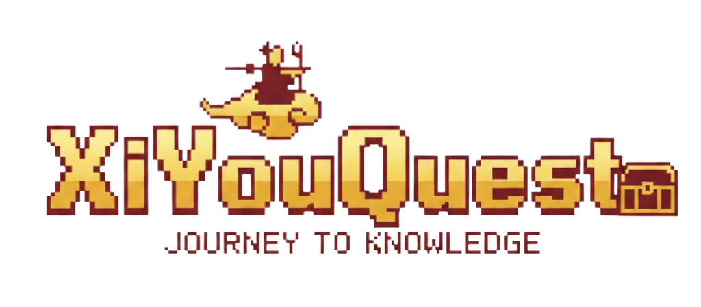

<h1 align="center">
  <br>
  
  <br>
  XiYouQuest — 西游Quest
  <br>
</h1>

<h3 align="center">
  AI-Powered Putonghua Proficiency Test Companion
</h3>

<p align="center">
  <em>Master the PSC exam through pronunciation battles, AI feedback, and a Journey to the West RPG adventure.</em>
</p>

<p align="center">
  
  
  
  
  
  
  
  
  
</p>

<p align="center">
  Built for the <strong>HKUST GenAI Hackathon</strong>
</p>

---

## Table of Contents

- [Overview](#overview)
- [Features](#features)
- [Architecture](#architecture)
- [Practice Components](#practice-components)
  - [C1: Monosyllabic Characters](#c1-monosyllabic-characters-读单音节字词)
  - [C2: Multisyllabic Words](#c2-multisyllabic-words-读多音节词语)
  - [C3: Vocabulary & Grammar](#c3-vocabulary--grammar-judgment-选择判断)
  - [C4: Passage Reading](#c4-passage-reading-朗读短文)
  - [C5: Prompted Speaking](#c5-prompted-speaking-命题说话)
  - [C6: Cantonese Mistakes Drill](#c6-cantonese-mistakes-drill-易错字词练习)
  - [C7: Polyphonic Characters Quiz](#c7-polyphonic-characters-quiz-多音字练习)
  - [Mock Exam](#mock-exam-full-psc-simulation)
- [Main Quest RPG](#main-quest-rpg)
- [Companion Chat](#companion-chat)
- [Personalized Learning Path](#personalized-learning-path)
- [Achievements](#achievements)
- [Speech Evaluation Engine](#speech-evaluation-engine)
- [Text-to-Speech System](#text-to-speech-system)
- [AI Feedback Pipeline](#ai-feedback-pipeline)
- [AI Image Generation](#ai-image-generation)
- [Gamification System](#gamification-system)
- [Social & Leaderboard](#social--leaderboard)
- [Character Companion System](#character-companion-system)
- [Authentication & Security](#authentication--security)
- [Edge Function Architecture](#edge-function-architecture)
- [Network Resilience](#network-resilience)
- [Tech Stack](#tech-stack)
- [Getting Started](#getting-started)
- [Project Structure](#project-structure)
- [API Reference](#api-reference)
- [Database Schema](#database-schema)
- [License](#license)

---

## Overview

XiYouQuest transforms Putonghua Proficiency Test (PSC / 普通话水平测试) preparation into a gamified, AI-driven adventure. Inspired by the classic Chinese novel *Journey to the West*, players travel alongside Sun Wukong and companions through a 7-stage RPG campaign — defeating bosses with their pronunciation skills while mastering all 5 official PSC exam components.

Every practice session flows through a multi-service pipeline:

```
Record -> WAV Encode -> iFlytek ISE -> XML Parse -> DeepSeek Feedback -> XP Award -> Achievement Check
```

---

## Features

| Feature | Description |
|---------|-------------|
| **7 Practice Components** | All 5 official PSC components + 2 supplementary drills (Cantonese mistakes, polyphonic characters) |
| **Main Quest RPG** | 7-stage Journey to the West campaign with turn-based pronunciation battles against mythical bosses |
| **Companion Chat** | Voice-driven conversations with AI companions — real-time pronunciation scoring, image generation, and scenario-based dialogue |
| **Personalized Learning Path** | AI-generated adaptive curriculum with multi-phase study plans, checkpoint assessments, and predicted PSC grade tracking |
| **Real-time Speech Scoring** | Phone-level accuracy, tone analysis, fluency metrics via iFlytek Intelligent Speech Evaluation |
| **AI Companions** | 4 Journey to the West characters with unique personalities, expressions, voice lines, and conversation styles |
| **AI Feedback** | Character-personalized, context-aware study tips powered by DeepSeek v3.2 via OpenRouter |
| **AI Image Generation** | Context-aware pixel-art scene images auto-generated every 3 chat turns via Gemini 2.5 Flash |
| **Full Mock Exam** | Timed 5-component simulation with official PSC grade mapping (一级甲等 to 三级乙等) and AI feedback reports |
| **TTS Playback** | Native Putonghua model audio for every word, sentence, and passage via iFlytek TTS |
| **Practice History** | Detailed session history with score trends, radar charts, component breakdowns, and AI-generated insights |
| **44 Achievements** | 4-tier achievement system (Common/Uncommon/Rare/Epic) with toast notifications and friend activity feed |
| **XP & Levels** | 10-tier progression from Beginner to PSC God with streak multipliers and daily bonuses |
| **Character Affection** | Build bonds with companions across 5 affection levels by practicing and chatting together |
| **Social System** | Friends, friend codes (PSC-XXXX), leaderboards, Discord friend suggestions |
| **Pixel-Art UI** | Press Start 2P fonts, vermilion Chinese-ink motifs, pixel borders, retro battle animations |

---

## Architecture

```
+---------------------------------------------------------------------+
|                          BROWSER (Client)                           |
|                                                                     |
|  +----------+  +--------------+  +-----------+  +---------------+   |
|  | Practice |  | AudioRecorder|  | Quest RPG |  | Companion     |   |
|  | Session  |  | (PCM 16kHz)  |  | Battles   |  | Chat + Learn  |   |
|  +----+-----+  +------+-------+  +-----+-----+  +------+--------+   |
|       |               |                |               |            |
|       +---------------+----------------+---------------+            |
|                        | fetchWithRetry                             |
|                        v (auto edge-routing)                        |
+--- Next.js 16 API Routes ---+--- Supabase Edge Functions ----------+
|                              |                                      |
|  +-------------+ +---------+|  +-------------+ +-----------------+ |
|  | /progress/* | | /social/*||  | ai-feedback | | speech-assess   | |
|  | /quest/*    | | /leader- ||  | ai-insights | | speech-c5-assess| |
|  | /mock-exam/*| |  board   ||  | ai-mock-exam| | tts-speak       | |
|  | /learning/* | | /achieve-||  | chat-start  | | tts-companion   | |
|  | /auth/*     | |  ments/* ||  | chat-respond| | learning-gen-   | |
|  | /chat/*     | |          ||  | chat-gen-img|   plan            | |
|  +------+------+ +----+----+|  +------+------+ +--------+--------+ |
|         |              |     |         |                 |          |
+---------+--------------+-----+---------+-----------------+----------+
          |              |               |                 |
   +-----------+  +----------+   +------------+   +-------------+
   |  Supabase |  | DeepSeek |   | iFlytek    |   | Gemini      |
   | PostgreSQL|  |   v3.2   |   | ISE+ASR+TTS|   | 2.5 Flash   |
   |  + RLS    |  |(OpenRouter)|  | (wss://)   |   |(OpenRouter) |
   |  + Storage|  | Feedback |   |            |   | Chat + Image|
   +-----------+  +----------+   +------------+   +-------------+
```

**Dual-deployment model:** Lightweight routes (CRUD, auth, social) run on Vercel. Long-running routes (AI, speech, TTS) run as Supabase Edge Functions (Deno, 150s timeout). Client-side `fetchWithRetry` transparently routes via `resolveEdgeRoute()`.

---

## Practice Components

### C1: Monosyllabic Characters (读单音节字词)

Practice individual Chinese character pronunciation with per-character tone and accuracy analysis.

```
Server: fetch 50 chars from question_banks -> shuffle -> pass to PracticeSession

Client (PracticeSession):
  Split into groups of 10 -> display as clickable grid

  For each group:
  1. Tap character -> POST /api/tts/speak -> iFlytek TTS -> WAV cached
  2. Record -> getUserMedia(16kHz) -> ScriptProcessor -> Float32 chunks
  3. Stop -> encodeWAV(16kHz, 16-bit, mono) -> Blob
  4. POST /api/speech/assess { category: "read_syllable" }
     -> iFlytek ISE WebSocket -> SSB + AUW frames -> base64 XML
     -> Parse per-word accuracy, tone, dp_message, perr_msg
  5. Score matching: filter insertions/omissions -> sequential word match
  6. POST /api/ai/feedback -> DeepSeek personality-driven feedback
  7. XP: >=90 -> 10, >=60 -> 5, <60 -> 2 (x streak multiplier)

  After final group -> POST /api/progress/update -> achievement check
```

### C2: Multisyllabic Words (读多音节词语)

Same architecture as C1 with key differences:

| Aspect | C1 | C2 |
|--------|----|----|
| Questions | Single characters | Compound words |
| ISE Category | `read_syllable` | `read_word` |
| XML Parsing | Per-syllable scores | `<word total_score>` with syllable breakdown |
| Tone Analysis | Single tone per character | Multi-tone per word (weighted average) |

### C3: Vocabulary & Grammar Judgment (选择判断)

Multiple-choice quiz testing vocabulary accuracy and grammatical judgment — no audio recording.

| Type | Format | Example |
|------|--------|---------|
| **word-choice** (词语判断) | Pick the standard Putonghua form | 垃圾 vs 拉圾 |
| **measure-word** (量词搭配) | Choose the correct measure word | 一___书 -> 本/个/条/只 |
| **sentence-order** (语序判断) | Select the grammatically correct sentence | Reordered sentence options |

5 questions per type = 15 total. Answer positions randomized via `useMemo`. Correct -> 10 XP + static explanation. Wrong -> 2 XP + DeepSeek-generated explanation.

### C4: Passage Reading (朗读短文)

Read a full Chinese passage aloud with sentence-by-sentence scoring.

```
Phase 1 - SELECT: Choose passage from grid (30 passages with images)
Phase 2 - READY: Interactive passage with per-sentence TTS playback
Phase 3 - RECORD: Full passage recording via AudioRecorder
Phase 4 - ASSESS: ISE read_chapter -> sentence-level scores + word detail
Phase 5 - FEEDBACK: Color-coded sentences (green >=80, yellow >=60, red <60)
           -> DeepSeek feedback -> companion dialogue -> progress update
```

### C5: Prompted Speaking (命题说话)

The most complex component — a 3-minute timed free-speaking exercise assessed by a 3-step pipeline.

```
Step 1: ASR Transcription (iFlytek IST WebSocket)
  -> PCM chunks -> real-time segment assembly -> raw transcript

Step 2: Parallel Assessment (Promise.all)
  +-- ISE Pronunciation (read_chapter, auto-chunked if >90s)
  +-- DeepSeek Content Analysis (vocabularyLevel, fluencyLevel, contentRelevance)

Step 3: calculateC5Score() - Official PSC rubric (30 pts -> normalized 0-100)
  +-- Pronunciation (20 pts): error count + dialect detection
  +-- Vocabulary/Grammar (5 pts): DeepSeek level 1-3
  +-- Fluency (5 pts): 3-tier ISE/DeepSeek fallback
  +-- Time penalty: -1/sec under 3 minutes
```

### C6: Cantonese Mistakes Drill (易错字词练习)

Supplementary pronunciation drill for common Cantonese-speaker errors:

| Category | Chinese | What it Drills |
|----------|---------|----------------|
| **zhcs** | 平翘舌音 | z/c/s vs zh/ch/sh confusion |
| **nng** | 前后鼻音 | -n vs -ng final confusion |
| **ln** | 边鼻音 | l vs n initial confusion |

2 groups x 5 words x 3 categories = 30 words across 6 rounds. Uses ISE `read_word` category.

### C7: Polyphonic Characters Quiz (多音字练习)

Supplementary MCQ testing polyphonic characters (多音字) — characters with multiple valid pronunciations. Reuses C3 `QuizSession`. Questions show sentences with the target character **highlighted**; options are pinyin readings. 15 questions per session.

### Mock Exam: Full PSC Simulation

Timed, sequential assessment of all 5 official components with AI-generated feedback reports:

| Component | Time Limit | Weight | Method |
|-----------|-----------|--------|--------|
| C1 Monosyllabic | 3:30 | 10% | ISE `read_syllable` |
| C2 Multisyllabic | 2:30 | 20% | ISE `read_word` |
| C3 Judgment | 3:00 | 10% | Local quiz scoring |
| C4 Passage | 4:00 | 30% | ISE `read_chapter` |
| C5 Speaking | 3:00 | 30% | 3-step C5 pipeline |

Results are persisted to `mock_exam_results` with component-level score breakdowns. An AI feedback report analyzes performance, identifies weak components, and suggests targeted drills.

**PSC Grade Mapping:**

| Score | Grade | Chinese |
|-------|-------|---------|
| 97+ | First Class, Grade A | 一级甲等 |
| 92-96 | First Class, Grade B | 一级乙等 |
| 87-91 | Second Class, Grade A | 二级甲等 |
| 80-86 | Second Class, Grade B | 二级乙等 |
| 70-79 | Third Class, Grade A | 三级甲等 |
| 60-69 | Third Class, Grade B | 三级乙等 |
| <60 | Below Standard | 不达标 |

---

## Main Quest RPG

A 7-stage story campaign themed after Journey to the West (西游记), where players defeat mythical bosses through pronunciation accuracy.

### The Journey

| Stage | Name | Boss | Character Unlock |
|-------|------|------|-----------------|
| 1 | Prologue (序章) | Demon King of Turmoil (混乱魔王) | -- (Sun Wukong is default) |
| 2 | River of Shattered Tone (碎调之河) | Water Spirit (水灵) | Tang Sanzang (三藏) |
| 3 | Desert of Illusion (幻影沙漠) | Lady of Bleached Bones (白骨夫人) | Sha Wujing (沙悟净) |
| 4 | Moonlit Mountain (月影山) | Moonfang Wolf Demon (月牙狼魔) | -- |
| 5 | Misty Bamboo Forest (迷雾竹林) | Bull Demon King (牛魔王) | -- |
| 6 | Plains of Fading Echoes (余音平原) | Heavenly Guardian (天庭守护者) | Zhu Bajie (猪八戒) |
| 7 | Western Palace (西天宫殿) | Twisted Sun Wukong (扭曲悟空) | -- |

### Battle System

```
+--- Turn Structure ---------------------------------------------------+
|                                                                       |
|  PLAYER TURN                                                          |
|    +-- Menu: Attack / Skip                                            |
|    +-- Record pronunciation (word group, max 5 per recording)         |
|    +-- ISE assess -> score >= 80 = HIT (boss takes damage)           |
|    +-- Score < 80 = MISS (no damage)                                  |
|                                                                       |
|  ENEMY TURN                                                           |
|    +-- Boss narration (3 thematic lines per stage, random)            |
|    +-- MCQ question with countdown timer                              |
|    |     Stages 1-4: 15 seconds                                       |
|    |     Stages 5-7: 12 seconds                                       |
|    +-- Correct = "BLOCKED!" (no damage)                               |
|    +-- Wrong/timeout = player loses 1 HP                              |
|                                                                       |
|  Repeat until boss HP = 0 (victory) or player HP = 0 (defeat)        |
+-----------------------------------------------------------------------+
```

**Player HP:** Base 3 + 2 per unlocked companion (max 9 with all 3 companions)
**Boss HP:** 100 (visual), damaged by `ceil(100 / totalRecordingGroups)` per hit
**XP Reward:** `mcqCorrect * 5 + round(avgPronScore / 10) * totalRecordings + stage * 10`

### Visual Components

- **Stage Select**: SVG world map with animated paths, locked/cleared/available node states
- **Battle Arena**: Full-screen backgrounds, party sprite lineup, boss with float animation
- **Attack Animation**: Wukong 3-frame dash toward boss with trail glow effects
- **Damage Numbers**: Floating damage text with fade-out animation
- **Turn Banners**: Cinematic "PLAYER TURN" / "ENEMY TURN" slide-in banners

---

## Companion Chat

An interactive voice-driven conversation system where users practice Mandarin with Journey to the West character companions in themed scenarios. Powered by **Gemini 2.5 Flash** (via OpenRouter) with **MiniMax M2.5** as fallback.

### Flow

```
Select Companion -> Select Scenario -> Chat (voice input + AI reply) -> Summary
```

### How It Works

1. **Scenario selection** — scenarios tied to quest stage progression across 3 categories: JTTW (Journey to the West lore), modern daily life, and PSC exam practice
2. **Voice input** — user speaks -> iFlytek ASR transcription -> ISE pronunciation/tone/fluency scoring
3. **AI response** — conversation history + user transcript fed to Gemini 2.5 Flash -> character-personalized reply with TTS voice. Falls back to MiniMax M2.5 after 3 retries with exponential backoff.
4. **Off-topic detection** — prompt-enforced via mandatory JSON response schema. The LLM must respond with either `{"type": "reply", "content": "..."}` for on-topic exchanges or `{"type": "redirect", "content": "..."}` for off-topic ones. Detection rules vary by scenario category:
   - **JTTW**: off-topic = unrelated to the scenario, Journey to the West world/lore, Mandarin practice, Chinese culture, or Tang Dynasty life
   - **Modern/PSC**: off-topic = violence, illegal activities, explicit content, character-breaking, or extended non-Chinese passages
   - Redirect responses stay in-character (companion expresses confusion and steers back). Off-topic exchanges are **not saved to the database** and award **0 XP / 0 affection**.
5. **Automatic scene images** — every 3 on-topic turns, the client non-blockingly triggers `/api/chat/generate-image`. It builds a conversation summary from the last 8 messages, sends it to **Gemini 2.5 Flash** (image mode), and the resulting pixel-art scene is uploaded to Supabase Storage and displayed as a context-aware background behind the chat.
6. **Session end** — summary with average scores, XP earned, affection gained, and all generated scene images

### Rewards

- **2-10 XP per turn** (based on pronunciation score)
- **+3 affection XP per turn** with the active companion
- **Streak bonus** if session has 5+ exchanges
- **Chat achievements** — First Words, Chatterbox (50 msgs), Polyglot (all companions), Storyteller (10 sessions)

---

## Personalized Learning Path

An AI-powered adaptive curriculum that assesses proficiency, generates a multi-phase study plan, and guides users through checkpoint assessments toward exam readiness.

### Pipeline

```
Initial Assessment (C1-C5 quick quizzes)
  -> AI Curriculum Generation (edge function)
     -> Multi-phase plan with learning nodes (drills + mock exams)
        -> Node completion (practice specific focus areas)
           -> Mid-checkpoint assessment + LLM feedback
              -> Phase progression
                 -> Final report with predicted PSC grade
```

### Key Features

- **AI-generated curriculum** — DeepSeek analyzes initial scores and creates a personalized multi-phase plan
- **Learning nodes** — drill and mock_exam type nodes targeting specific components and focus areas
- **Checkpoint assessments** — mid-plan quizzes with score delta tracking and AI-written progress feedback
- **Predicted grade trajectory** — shows expected PSC grade at each checkpoint
- **Seeded question banks** — fallback character banks (100 monosyllabic, 50 multisyllabic) if DB questions unavailable

### Achievements

| Key | Name | Tier | Trigger |
|-----|------|------|---------|
| `learning_first_step` | First Step (学习启程) | Common | Complete initial assessment |
| `learning_on_track` | On Track (按部就班) | Uncommon | Complete first mid-checkpoint |
| `learning_adapting` | Adapting (因材施教) | Rare | Complete all 3 mid-checkpoints |
| `learning_exam_ready` | Exam Ready (胸有成竹) | Epic | Complete entire learning plan |

---

## Achievements

44 achievements across 4 tiers, tracked via event-driven checks at 8 trigger points.

### Tiers

| Tier | Color | Count | Examples |
|------|-------|-------|---------|
| Common | Bronze | 6 | First Steps, Honorable Defeat, Fellow Traveler, Trial by Fire, First Words, First Step |
| Uncommon | Silver | 12 | Stage 1-7 Cleared, Character Apprentice x4, Chatterbox |
| Rare | Gold | 12 | Stage 1-7 Flawless, Character Adept x4, Polyglot |
| Epic | Purple | 8 | Journey Complete, Character Master x4, Last Stand, Storyteller, Exam Ready |

### Trigger Points

| Event | Where | Achievements Checked |
|-------|-------|---------------------|
| `account_created` | OAuth callback | First Steps |
| `quest_clear` | Quest progress API | Stage cleared, flawless, all stages, character unlocks |
| `quest_fail` | Quest progress API | Honorable Defeat |
| `session_complete` | Progress update API | Character bond milestones (5/10/20 sessions) |
| `friend_added` | Social respond API | Fellow Traveler |
| `mock_exam_complete` | Mock exam API | Trial by Fire |
| `chat_complete` | Chat end API | First Words, Chatterbox, Polyglot, Storyteller |
| `learning_checkpoint` | Learning APIs | Learning path milestones (first step through exam ready) |

### Achievement Page

- Completion summary bar: `X / 44 (Y%)`
- Per-tier breakdown with colored badges
- Filterable grid (All / Common / Uncommon / Rare / Epic)
- Locked achievements shown dimmed with descriptions still visible
- Friend activity feed showing last 20 achievement unlocks across your network

---

## Speech Evaluation Engine

All pronunciation assessment is powered by **iFlytek ISE** (Intelligent Speech Evaluation) via server-side WebSocket.

### WebSocket Protocol

```
Client (Edge Function)                iFlytek ISE Server
       |                              wss://ise-api-sg.xf-yun.com/v2/ise
       |                                       |
       | -- HMAC-SHA256 signed URL ----------> |
       | -- SSB: params + UTF-8 BOM text ----> |
       | -- AUW: 10KB PCM chunks ------------> |
       |    (backpressure: pause if >64KB)     |
       | -- AUW final (status: 2) -----------> |
       | <-- base64 XML result --------------- |
```

### ISE Categories

| Category | Used By | Score Attributes |
|----------|---------|-----------------|
| `read_syllable` | C1 | total, phone, fluency, tone, integrity |
| `read_word` | C2, C6 | total, phone, fluency, tone, integrity |
| `read_chapter` | C4, C5 | total, phone, fluency, tone, integrity |

### Error Detection

| dp_message Bit | Meaning | perr_msg Bit | Meaning |
|----------------|---------|-------------|---------|
| 128 | Mispronunciation | 1 | Vowel error |
| 64 | Repetition | 2 | Tone error |
| 32 | Insertion | 3 | Vowel + tone |
| 16 | Omission | | |

---

## Text-to-Speech System

All TTS uses **iFlytek's WebSocket API** (`wss://tts-api-sg.xf-yun.com/v2/tts`) with HMAC-SHA256 auth.

| Mode | Function | Use Case |
|------|----------|----------|
| **Academic** | `synthesizeAcademic()` | Individual words, passages, sentences |
| **Companion** | Via `/api/tts/companion` | Character voice lines during dialogue and chat |

- **15 iFlytek voices** configured (default: `x_xiaoyan`)
- **Server-side LRU cache**: 500 entries, keyed on `academic:voiceId:text`
- **Output**: PCM 16kHz 16-bit mono, wrapped in WAV headers
- **Client-side**: Audio ObjectURL cache per session for instant replay

---

## AI Feedback Pipeline

**DeepSeek v3.2** (via OpenRouter) generates contextual, personality-driven feedback across multiple systems:

### Practice Feedback

```
Input:
  characterPrompt + component + questionText + score + isCorrect
                         |
                         v
  DeepSeek System Prompt:
    "{personality} helping a PSC student (Component X).
     Chinese+English mix. Under 3 sentences."
                         |
                         v
  retryWithBackoff(maxRetries=3, delays: 1s/2s/4s + jitter)
                         |
                         v
  Success -> personality-driven feedback
  Exhausted -> fallback Chinese/English canned messages
```

### C5 Content Analysis

For prompted speaking, DeepSeek returns structured JSON with `vocabularyLevel` (1-3), `fluencyLevel` (1-3), `contentRelevance`, and detailed notes — feeding directly into the official PSC C5 scoring formula.

### AI Insights

`/api/ai/insights` takes a user's full progress data, recent sessions, and quest progress, then generates a structured analysis:
- **Performance Overview** — hit rates, untouched components, trends
- **Diagnosis** — root causes, cross-reference patterns, PSC grade impact
- **Recommended Strategy** — prioritized action plan with specific drills

### Mock Exam Feedback

`/api/ai/mock-exam-feedback` produces a comprehensive report after full exam simulation — analyzing component-by-component performance, identifying the weakest areas, and suggesting targeted improvement strategies.

---

## AI Image Generation

**Gemini 2.5 Flash** (via OpenRouter, `google/gemini-2.5-flash-image:nitro`) generates context-aware pixel-art scene images during companion chats.

- **Trigger**: automatically fires every **3 on-topic user turns** (turn 3, 6, 9, ...) — non-blocking, runs in the background while the conversation continues
- **Context building**: summarizes the last 8 messages into a scene description, combined with companion name and scenario title
- **Input sanitization**: conversation summary capped at 2,000 chars with prompt injection prevention (`[SCENE DESCRIPTION START]`/`[END]` delimiters)
- **Output**: 16:9 pixel-art PNG — 16-bit style, muted earth tones, warm lighting, Chinese landscape elements, no text in image
- **Storage**: uploaded to `chat-images` bucket in Supabase Storage, URL attached to the latest companion message record
- **Display**: rendered as an atmospheric background behind the chat interface, creating an evolving visual narrative as the conversation progresses
- **Format support**: handles data URLs, inline_data parts, and message.images array responses from OpenRouter

---

## Gamification System

### XP Economy

| Action | Base XP | Condition |
|--------|---------|-----------|
| Perfect pronunciation | 10 | Score >= 90 |
| Good pronunciation | 5 | Score 60-89 |
| Attempted | 2 | Score < 60 |
| Quiz correct | 10 | -- |
| Quiz wrong | 2 | -- |
| Daily login bonus | 25 | First session of the day |
| Chat turn | 2-10 | Based on pronunciation score |

**Streak Multipliers:** 5+ consecutive days = 1.5x, 10+ = 2.0x
**Session Cap:** 2,000 XP max per session (server-enforced, 50 XP cap for zero-question sessions)

### Level Progression

```
Lv.1  Beginner           0 XP
Lv.2  Learner          100 XP
Lv.3  Student          300 XP
Lv.4  Practitioner     600 XP
Lv.5  Scholar        1,000 XP
Lv.6  Expert         1,500 XP
Lv.7  Master         2,500 XP
Lv.8  Grandmaster    4,000 XP
Lv.9  Legend         6,000 XP
Lv.10 PSC God       10,000 XP
```

### Character Affection

| Level | Title | XP Required |
|-------|-------|------------|
| 1 | Acquaintance | 0 |
| 2 | Friend | 200 |
| 3 | Close Friend | 500 |
| 4 | Best Friend | 1,000 |
| 5 | Soulmate | 2,000 |

Affection grows by practicing with a specific companion and through companion chat sessions (+3 XP per chat turn). Higher affection unlocks cosmetic skins.

---

## Social & Leaderboard

### Friend System

```
Search by name (/api/social/search)
  or Friend code lookup (/api/social/lookup) -- format: PSC-XXXX
    -> Send Request (/api/social/request)
         -> Pending notification (badge in navbar)
              -> Accept/Reject (/api/social/respond)
                   -> Friends list with live stats (/api/social/friends)
```

**Friend Stats:** Per-friend cards show XP comparison (arrow up/down), streak, sessions, average score per component (C1-C7 progress bars), active companion, achievement count.

**Discord Suggestions:** If authenticated via Discord OAuth (`relationships.read` scope), the app can suggest friends by cross-referencing Discord relationships with registered users.

### Leaderboard

| Tab | Metric | Scope |
|-----|--------|-------|
| XP | Total experience points | Global (top 20) or Friends |
| Accuracy | % correct across all components | Global or Friends |
| Streak | Consecutive login days | Global or Friends |

Top 3 displayed in podium layout `[2nd, 1st, 3rd]` with crown and trophy icons. If the user isn't in the global top 20, their rank is shown below.

---

## Character Companion System

Four Journey to the West (西游记) companions, unlocked through quest progression:

| Character | Name | Quest Unlock | Role |
|-----------|------|-------------|------|
| Sun Wukong | 孙悟空 | Default | The Monkey King — bold, confident, encouraging |
| Tang Sanzang | 三藏 | Stage 2 | The Monk — patient, scholarly, gentle guidance |
| Sha Wujing | 沙悟净 | Stage 3 | The Sand Monk — calm, supportive, methodical |
| Zhu Bajie | 猪八戒 | Stage 6 | The Pig — humorous, warm, celebrates small wins |

Each character has:
- **Unique personality prompt** for AI feedback personalization (DeepSeek for practice, Gemini for chat)
- **Expression images** (neutral, happy, proud, excited, thinking, encouraging, etc.) with fade transitions
- **Voice ID** mapped to iFlytek TTS for dialogue voice lines and companion chat
- **Affection system** — 5 levels from Acquaintance to Soulmate
- **Battle sprites** — animated party members in Main Quest battles (Wukong has 3-frame attack animation)
- **Chat personality** — distinct conversation styles in companion chat scenarios

---

## Authentication & Security

### Three-Layer Auth

```
Request -> Layer 1: Middleware (src/proxy.ts)
            Refreshes Supabase session cookie on EVERY request
            Public paths: /login, /api/auth/callback
            Unauthed + API -> 401 JSON
            Unauthed + page -> redirect /login

        -> Layer 2: Layout Guard -- (main)/layout.tsx
            getUser() server-side
            Fetches profile + friend request count in Promise.all
            All child pages safely use user!.id

        -> Layer 3: API Route Guards
            Every API route independently verifies auth
```

### Login Methods

| Method | Flow |
|--------|------|
| **Email/Password** | `signInWithPassword()` -> redirect to `/dashboard` |
| **Email Sign-up** | `signUp()` -> DB trigger creates profile + default characters |
| **Google OAuth** | `signInWithOAuth({ provider: "google" })` -> callback -> session |
| **Discord OAuth** | `signInWithOAuth({ provider: "discord" })` + `relationships.read` for friend suggestions |

### Security Measures

- **Row Level Security (RLS)** on all database tables
- **Server-side XP clamping** — `MAX_XP_PER_SESSION = 2000`
- **Zod validation** on all API inputs (`progressUpdateSchema`, `leaderboardQuerySchema`, `ttsSchema`, etc.)
- **HMAC-SHA256 auth** for all iFlytek WebSocket connections
- **Security headers** — `X-Content-Type-Options: nosniff`, `X-Frame-Options: DENY`, HSTS
- **Cascading account deletion** — cleans up all user data across all tables + storage
- **Input sanitization** — image generation prompts capped at 2,000 chars with injection prevention

---

## Edge Function Architecture

11 long-running API routes are deployed as **Supabase Edge Functions** (Deno runtime, 150s timeout) to bypass Vercel's 10s free-tier limit. Client-side routing is transparent.

### Route Mapping

| Vercel Route | Edge Function | External APIs |
|---|---|---|
| `/api/ai/feedback` | `ai-feedback` | OpenRouter LLM |
| `/api/ai/insights` | `ai-insights` | OpenRouter LLM |
| `/api/ai/mock-exam-feedback` | `ai-mock-exam-feedback` | OpenRouter LLM |
| `/api/chat/generate-image` | `chat-generate-image` | OpenRouter Image + Supabase Storage |
| `/api/chat/start` | `chat-start` | OpenRouter LLM + iFlytek TTS |
| `/api/chat/respond` | `chat-respond` | iFlytek ASR + ISE + OpenRouter LLM |
| `/api/learning/generate-plan` | `learning-generate-plan` | OpenRouter LLM + DB |
| `/api/speech/assess` | `speech-assess` | iFlytek ISE |
| `/api/speech/c5-assess` | `speech-c5-assess` | iFlytek ASR + ISE + OpenRouter LLM |
| `/api/tts/speak` | `tts-speak` | iFlytek TTS |
| `/api/tts/companion` | `tts-companion` | iFlytek TTS |

### How It Works

- **Routing:** `src/lib/edge-routing.ts` maps paths to edge URLs + injects Supabase auth token. `fetchWithRetry` calls `resolveEdgeRoute()` before any request.
- **Shared code:** `supabase/functions/_shared/` contains 13 Deno modules — AI client, iFlytek (ASR/ISE/TTS/auth), image generation, C5 scoring, chat prompts, player memory, validation, CORS, env, and Supabase client.
- **Auth:** Edge functions receive `Authorization: Bearer <token>` header, create per-request Supabase client. Deployed with `--no-verify-jwt` (auth handled internally).
- **Deno specifics:** `npm:` specifiers (not bare imports), `Deno.env.get()`, Web Crypto API, native WebSocket, `Uint8Array` instead of `Buffer`.

---

## Network Resilience

A multi-layer resilience stack ensures the app degrades gracefully under poor network conditions:

```
Layer 1 - Client: fetchWithRetry (3 retries, exponential backoff with jitter)
           Retryable: 429, 500, 502, 503  |  Non-retryable: 400, 401, 403, 404

Layer 2 - Server: AI retryWithBackoff (3 retries, 1s/2s/4s + jitter)

Layer 3 - Server: TTS in-memory LRU cache (500 entries)

Layer 4 - Client: Audio ObjectURL cache (Map<word, ObjectURL> per session)

Layer 5 - Client: Browser Web Speech API fallback for TTS failures

Layer 6 - Client: Hardcoded feedback strings when AI is unreachable
```

All 24+ internal API fetch calls across all practice components, companion chat, and learning path are covered by `fetchWithRetry` with automatic edge function routing.

---

## Tech Stack

| Layer | Technology | Purpose |
|-------|-----------|---------|
| **Framework** | Next.js 16.1.6 (App Router, Turbopack) | Server/client rendering, API routes |
| **UI Library** | React 19.2.3 | Component architecture |
| **Language** | TypeScript 5 (strict mode) | Type safety |
| **Database** | Supabase (PostgreSQL + RLS + Storage) | Data persistence, auth, file storage |
| **Edge Runtime** | Supabase Edge Functions (Deno) | Long-running AI/speech routes (150s timeout) |
| **Auth** | Supabase Auth | Email, Google OAuth, Discord OAuth |
| **AI Feedback** | DeepSeek v3.2 (via OpenRouter) | Practice feedback, C5 content analysis, insights, curriculum |
| **AI Chat** | Gemini 2.5 Flash (via OpenRouter) | Companion chat conversation (fallback: MiniMax M2.5) |
| **AI Image Generation** | Gemini 2.5 Flash Image (via OpenRouter) | Context-aware pixel-art scene images every 3 chat turns |
| **Speech Assessment** | iFlytek ISE (WebSocket) | Pronunciation scoring (zh-CN) |
| **Speech Recognition** | iFlytek IST (WebSocket) | Speech-to-text for C5 and companion chat |
| **Text-to-Speech** | iFlytek TTS (WebSocket) | Native Putonghua audio synthesis |
| **Styling** | Tailwind CSS 4 | Utility-first CSS |
| **UI Components** | shadcn/ui (New York) + Radix UI | Accessible component primitives |
| **Charts** | Recharts | Score trends, radar charts, progress visualization |
| **Icons** | Lucide React | Consistent icon set |
| **Notifications** | Sonner | Toast notifications |
| **Validation** | Zod | Runtime schema validation |
| **Testing** | Vitest + Testing Library | Unit & component tests |
| **Analytics** | Vercel Analytics | Usage tracking |
| **Fonts** | Press Start 2P, VT323, ZCOOL XiaoWei | Pixel headings, retro body, Chinese display |
| **Deployment** | Vercel + Supabase | Frontend hosting + edge functions |

---

## Getting Started

### Prerequisites

- [Node.js](https://nodejs.org) 18+
- A [Supabase](https://supabase.com) project
- API keys: iFlytek (ISE + TTS + IST), OpenRouter

### 1. Clone and Install

```bash
git clone <repo-url>
cd PCSWebTool
npm install
```

### 2. Configure Environment

Create `.env.local`:

```env
# Supabase
NEXT_PUBLIC_SUPABASE_URL=https://your-project.supabase.co
NEXT_PUBLIC_SUPABASE_ANON_KEY=your_anon_key
SUPABASE_SERVICE_ROLE_KEY=your_service_role_key

# OpenRouter (DeepSeek v3.2 + Gemini 2.5 Flash)
OPENROUTER_API_KEY=your_openrouter_api_key

# iFlytek (shared by ISE, TTS, and IST)
IFLYTEK_APP_ID=your_app_id
IFLYTEK_API_KEY=your_api_key
IFLYTEK_API_SECRET=your_api_secret
```

### 3. Set Up Database

Apply migrations to your Supabase project. The schema creates tables with RLS policies:

| Table | Purpose |
|-------|---------|
| `profiles` | User XP, level, streaks, friend code, display name |
| `user_progress` | Per-component aggregate stats (C1-C7) |
| `characters` | AI companion definitions and personality prompts |
| `character_expressions` | Expression images per character |
| `character_skins` | Unlockable cosmetics by affection level |
| `user_characters` | Unlock state, affection, skin selection |
| `practice_sessions` | Individual session history |
| `practice_details` | Per-question results within sessions |
| `question_banks` | Questions for all 7 components |
| `friendships` | Friend requests and relationships |
| `achievements` | Static achievement catalog (44 achievements) |
| `user_achievements` | Per-user unlock records with timestamps |
| `quest_progress` | Quest stage progress, attempts, best scores |
| `chat_sessions` | Companion chat session metadata |
| `chat_messages` | Chat message history with scores |
| `chat_scenarios` | Scenario definitions tied to quest stages |
| `scenario_backgrounds` | Per-character scenario background images |
| `learning_plans` | Personalized learning plan metadata |
| `learning_nodes` | Individual curriculum items per plan |
| `learning_checkpoints` | Mid-plan assessment results |
| `mock_exam_results` | Full mock exam results with AI feedback |

Database triggers auto-create a `profiles` row on signup and unlock default characters.

### 4. Deploy Edge Functions

```bash
# Deploy all 11 edge functions to Supabase
supabase functions deploy ai-feedback --no-verify-jwt
supabase functions deploy ai-insights --no-verify-jwt
supabase functions deploy ai-mock-exam-feedback --no-verify-jwt
supabase functions deploy chat-generate-image --no-verify-jwt
supabase functions deploy chat-start --no-verify-jwt
supabase functions deploy chat-respond --no-verify-jwt
supabase functions deploy learning-generate-plan --no-verify-jwt
supabase functions deploy speech-assess --no-verify-jwt
supabase functions deploy speech-c5-assess --no-verify-jwt
supabase functions deploy tts-speak --no-verify-jwt
supabase functions deploy tts-companion --no-verify-jwt
```

### 5. OAuth Setup (Optional)

**Google:**
1. Create OAuth 2.0 Client at [Google Cloud Console](https://console.cloud.google.com/apis/credentials)
2. Add `https://your-project.supabase.co/auth/v1/callback` as redirect URI
3. Enable Google in Supabase Auth Providers

**Discord:**
1. Create application at [Discord Developer Portal](https://discord.com/developers/applications)
2. Add same callback URI + enable `relationships.read` scope for friend suggestions
3. Enable Discord in Supabase Auth Providers

### 6. Run

```bash
npm run dev
```

Open [http://localhost:3000](http://localhost:3000).

---

## Project Structure

```
src/
+-- app/
|   +-- page.tsx                          # Auth redirect -> /login or /dashboard
|   +-- layout.tsx                        # Root layout (fonts, theme, Vercel Analytics)
|   +-- globals.css                       # Pixel-art theme, Chinese motifs, battle animations
|   +-- (auth)/login/                     # Login/signup + OAuth
|   +-- (main)/                           # Protected routes (3-layer auth)
|   |   +-- layout.tsx                    # Auth guard + navbar + achievement toast provider
|   |   +-- dashboard/                    # Home hub -- splash screen + tile menu
|   |   +-- main-quest/                   # RPG campaign -- 7-stage story + battles
|   |   +-- practice/                     # Quest board -- 7 component cards
|   |   +-- component-[1-7]/             # Practice components C1-C7
|   |   +-- mock-exam/                    # Full exam simulation (ExamRunner)
|   |   +-- companion-chat/               # Voice-driven AI companion conversations
|   |   +-- learning-path/                # Personalized AI-generated study plans
|   |   +-- practice-history/             # Session history, trends, AI insights
|   |   +-- achievements/                 # Achievement showcase + activity feed
|   |   +-- leaderboard/                  # Global + friends rankings
|   |   +-- characters/                   # Gallery, quest unlocks, affection
|   |   +-- profile/                      # Stats, history, danger zone
|   |   +-- social/                       # Friends, requests, search
|   +-- api/                              # 39 API routes
|       +-- ai/                           # feedback, insights, mock-exam-feedback
|       +-- auth/                         # callback, delete-account
|       +-- chat/                         # start, respond, end, resume, history, delete, generate-image
|       +-- learning/                     # plan, report, generate-plan, checkpoint/*, node/*,  reset
|       +-- mock-exam/                    # save, history
|       +-- progress/                     # update
|       +-- quest/                        # progress
|       +-- social/                       # search, lookup, request, requests, request-count,
|       |                                   respond, friends, remove, discord-suggestions
|       +-- speech/                       # assess, c5-assess
|       +-- tts/                          # speak, companion
|       +-- leaderboard/                  # global + friends rankings
|       +-- achievements/                 # feed, mock-exam
+-- components/
|   +-- ui/                               # shadcn/ui primitives (Button, Card, Dialog, etc.)
|   +-- shared/                           # Navbar, XPBar, ContentWrapper, AchievementToast,
|   |                                       AudioSettings, BGMProvider, SettingsDialog
|   +-- character/                        # CharacterDisplay, DialogueBox
|   +-- practice/                         # AudioRecorder (WAV PCM encoder)
|   +-- quest/                            # 12 battle/story RPG components
+-- lib/
|   +-- supabase/                         # Browser + server Supabase clients
|   +-- iflytek-speech/                   # ISE + IST WebSocket clients
|   +-- voice/                            # TTS WebSocket client + pinyin lookup data
|   +-- gemini/                           # DeepSeek AI client (via OpenRouter) with retry logic
|   +-- image-gen/                        # Gemini 2.5 Flash image generation client
|   +-- quest/                            # Battle logic, stage config, story text
|   +-- chat/                             # Companion chat prompt building, helpers
|   +-- achievements/                     # 44 achievement definitions + event-driven checks
|   +-- gamification/                     # XP, levels, streaks, affection calculations
|   +-- scoring/                          # C5 official PSC scoring rubric
|   +-- edge-routing.ts                   # Dynamic edge function URL resolution
|   +-- *.ts                              # Pinyin, audio utils, character images, env, validation
+-- types/                                # TypeScript interfaces (database, character, practice, gamification)
+-- data/                                 # Question bank source files

supabase/
+-- functions/                            # 11 Deno edge functions
|   +-- _shared/                          # 13 shared Deno modules (AI, iFlytek, scoring, etc.)
|   +-- ai-feedback/                      # Practice session AI feedback
|   +-- ai-insights/                      # Progress analysis and study strategy
|   +-- ai-mock-exam-feedback/            # Mock exam performance report
|   +-- chat-generate-image/              # Pixel-art scene image generation
|   +-- chat-start/                       # Companion chat session initialization
|   +-- chat-respond/                     # Voice input -> ASR -> ISE -> LLM reply
|   +-- learning-generate-plan/           # AI curriculum generation
|   +-- speech-assess/                    # Generic speech assessment (C1-C4, C6)
|   +-- speech-c5-assess/                 # Specialized C5 prompted speaking evaluation
|   +-- tts-speak/                        # Text-to-speech for practice
|   +-- tts-companion/                    # Text-to-speech for companion voice
+-- migrations/                           # SQL schema + seed data

docs/plans/                               # 17 design & implementation documents
public/img/                               # Sprites, backgrounds, boss art
```

---

## API Reference

### Speech & Audio

| Method | Endpoint | Input | Output |
|--------|----------|-------|--------|
| POST | `/api/speech/assess` | FormData: `audio`, `referenceText`, `category` | Per-word scores + aggregates |
| POST | `/api/speech/c5-assess` | FormData: `audio`, `topic`, `spokenDurationSeconds` | C5 score breakdown (pronunciation, vocab, fluency, time) |
| POST | `/api/tts/speak` | JSON: `{ voiceId, text }` | `audio/wav` (LRU cached) |
| POST | `/api/tts/companion` | JSON: `{ voiceId, text }` | `audio/wav` |

### AI

| Method | Endpoint | Input | Output |
|--------|----------|-------|--------|
| POST | `/api/ai/feedback` | JSON: character prompt, component, question, score, isCorrect | Personality-driven feedback |
| POST | `/api/ai/insights` | JSON: progress data, sessions, quest progress | Structured performance analysis |
| POST | `/api/ai/mock-exam-feedback` | JSON: exam results, component scores | Comprehensive exam feedback report |

### Companion Chat

| Method | Endpoint | Input | Output |
|--------|----------|-------|--------|
| POST | `/api/chat/start` | JSON: characterId, scenarioId | Session + opening message + TTS audio |
| POST | `/api/chat/respond` | FormData: audio, sessionId | Transcript, scores, AI reply, TTS |
| POST | `/api/chat/end` | JSON: sessionId | Summary + avg scores + achievements |
| POST | `/api/chat/resume` | JSON: sessionId | Session + message history |
| GET | `/api/chat/history` | Query: `?sessionId=` (optional) | All sessions or specific session messages |
| POST | `/api/chat/delete` | JSON: sessionId | Confirmation |
| POST | `/api/chat/generate-image` | JSON: sessionId, context | Image URL (Supabase Storage) |

### Learning Path

| Method | Endpoint | Input | Output |
|--------|----------|-------|--------|
| GET | `/api/learning/plan` | -- | User's current learning plan |
| POST | `/api/learning/generate-plan` | JSON: initial assessment scores | AI-generated curriculum |
| POST | `/api/learning/plan/reset` | -- | Reset current plan |
| POST | `/api/learning/node/start` | JSON: nodeId | Node activation |
| POST | `/api/learning/node/complete` | JSON: nodeId, score | Node completion + XP |
| POST | `/api/learning/checkpoint/complete` | JSON: checkpoint data | Checkpoint assessment + LLM feedback |
| GET | `/api/learning/report` | -- | Final learning plan report |

### Progress & Quest

| Method | Endpoint | Input | Output |
|--------|----------|-------|--------|
| POST | `/api/progress/update` | Session stats, XP, component, character | Updated XP, level, affection, newAchievements |
| GET | `/api/quest/progress` | -- | All quest stage progress |
| POST | `/api/quest/progress` | Stage, score, HP, results | Updated stage progress + character unlocks |
| GET | `/api/leaderboard` | Query: `?type=global\|friends` | Ranked user stats |

### Mock Exam

| Method | Endpoint | Input | Output |
|--------|----------|-------|--------|
| POST | `/api/mock-exam/save` | JSON: component scores, total score, grade | Saved exam result |
| PATCH | `/api/mock-exam/save` | JSON: examId, AI feedback | Updated exam with feedback |
| GET | `/api/mock-exam/history` | -- | Past exam results (limit 50) |

### Achievements

| Method | Endpoint | Input | Output |
|--------|----------|-------|--------|
| GET | `/api/achievements/feed` | -- | Last 20 achievement events (user + friends) |
| POST | `/api/achievements/mock-exam` | -- | Mock exam achievement check |

### Social

| Method | Endpoint | Description |
|--------|----------|-------------|
| GET | `/api/social/search?q=` | Search users by display name (min 2 chars) |
| GET | `/api/social/lookup?displayName=` | Find user by friend code |
| POST | `/api/social/request` | Send friend request |
| GET | `/api/social/requests` | List pending requests (incoming + outgoing) |
| GET | `/api/social/request-count` | Pending count for navbar badge |
| POST | `/api/social/respond` | Accept/reject + achievement trigger |
| GET | `/api/social/friends` | Friends with full stats |
| DELETE | `/api/social/remove` | Remove friend |
| GET | `/api/social/discord-suggestions` | Discord-linked suggestions |

### Auth

| Method | Endpoint | Description |
|--------|----------|-------------|
| GET | `/api/auth/callback` | OAuth PKCE code exchange |
| DELETE | `/api/auth/delete-account` | Cascading account deletion |

---

## Database Schema

```sql
profiles               user_progress          practice_sessions
+----------------+     +------------------+   +--------------------+
| id (uuid, PK)  |     | id               |   | id                 |
| username        |     | user_id (FK)     |   | user_id (FK)       |
| display_name    |     | component (1-7)  |   | character_id (FK)  |
| avatar_url      |     | questions_done   |   | component (1-7)    |
| total_xp        |     | questions_correct|   | score              |
| current_level   |     | best_streak      |   | xp_earned          |
| login_streak    |     | total_time_secs  |   | duration_seconds   |
| last_login_date |     | last_practiced   |   | created_at         |
| discord_id      |     +------------------+   +--------------------+
| friend_code     |
+----------------+     practice_details       friendships
                       +------------------+   +------------------+
characters             | id               |   | id               |
+----------------+     | session_id (FK)  |   | requester_id(FK) |
| id             |     | question_text    |   | addressee_id(FK) |
| name           |     | user_answer      |   | status           |
| personality_*  |     | is_correct       |   | created_at       |
| voice_id       |     | pron_score       |   | updated_at       |
| image_url      |     | feedback         |   +------------------+
| unlock_stage   |     +------------------+
| is_default     |                            achievements
+----------------+     quest_progress         +------------------+
                       +------------------+   | id               |
character_expressions  | id               |   | key (unique)     |
+------------------+   | user_id (FK)     |   | name             |
| character_id(FK) |   | stage (1-7)      |   | description      |
| expression_name  |   | is_cleared       |   | emoji            |
| image_url        |   | attempts         |   | tier             |
+------------------+   | best_score       |   | sort_order       |
                       | cleared_at       |   +------------------+
character_skins        +------------------+
+------------------+                          user_achievements
| character_id(FK) |   user_characters        +------------------+
| skin_name        |   +------------------+   | user_id (FK)     |
| image_url        |   | user_id (FK)     |   | achievement_id   |
| required_affection|  | character_id(FK) |   | unlocked_at      |
+------------------+   | affection_xp     |   +------------------+
                       | affection_level  |
question_banks         | active_skin_id   |   mock_exam_results
+------------------+   | is_selected      |   +------------------+
| component (1-7)  |   +------------------+   | id               |
| content          |                          | user_id (FK)     |
| pinyin           |   chat_sessions          | total_score      |
| metadata (JSONB) |   +------------------+   | grade            |
+------------------+   | id               |   | component_scores |
                       | user_id (FK)     |   | ai_feedback      |
learning_plans         | character_id(FK) |   | duration_seconds |
+------------------+   | scenario_id(FK)  |   | total_xp         |
| id               |   | message_count    |   +------------------+
| user_id (FK)     |   | avg_score        |
| exam_date        |   | xp_earned        |   chat_messages
| initial_scores   |   | affection_earned |   +------------------+
| current_phase    |   | ended_at         |   | id               |
| status           |   +------------------+   | session_id (FK)  |
| ai_analysis      |                          | role             |
+------------------+   chat_scenarios         | content          |
                       +------------------+   | transcript       |
learning_nodes         | id               |   | pron_score       |
+------------------+   | stage_number     |   | tone_score       |
| id               |   | title            |   | fluency_score    |
| plan_id (FK)     |   | description      |   | image_url        |
| phase            |   | system_prompt    |   +------------------+
| component        |   | category         |
| node_type        |   +------------------+   scenario_backgrounds
| focus_area       |                          +------------------+
| question_ids     |   learning_checkpoints   | scenario_id (FK) |
| score            |   +------------------+   | character_id(FK) |
| status           |   | plan_id (FK)     |   | background_url   |
+------------------+   | checkpoint_num   |   +------------------+
                       | scores           |
                       | score_deltas     |
                       | llm_feedback     |
                       | predicted_grade  |
                       +------------------+
```

All tables have **Row Level Security** enabled — users can only access their own data.

---

## Scripts

```bash
npm run dev        # Dev server at localhost:3000 (Turbopack)
npm run build      # Production build
npm run start      # Production server
npm run lint       # ESLint
npm run test       # Vitest unit tests
npm run test:watch # Vitest watch mode
```

---

## UI Theme

A pixel-art retro aesthetic with Chinese-ink influences:

- **Fonts**: Press Start 2P (pixel headings), VT323 (retro body text), ZCOOL XiaoWei (Chinese display)
- **Palette**: Warm cream (`#FFF8E7`), vermilion red (`#C8102E`), rosewood (`#8B4513`), gold accent (`#C9A96E`)
- **Effects**: `pixel-border`, `pixel-glow`, `pixel-btn` (4px drop shadow), `border-radius: 0px`
- **Chinese motifs**: `chinese-frame` (double rosewood/gold border), `chinese-corner` (vermilion L-brackets), `chinese-divider` (gradient diamond line)
- **Battle animations**: 15+ keyframes including idle-bob, boss-float, flinch, attack-trail, damage-float, heart-shatter
- **Accessibility**: Full `prefers-reduced-motion` support — all animations disabled when requested

---

## Documentation

| Document | Path |
|----------|------|
| Project Instructions (Claude) | `CLAUDE.md` |
| Initial Design | `docs/plans/2026-02-08-psc-webtool-design.md` |
| Implementation Plan | `docs/plans/2026-02-08-psc-webtool-implementation.md` |
| Social System | `docs/plans/2026-02-11-social-friends-design.md` |
| Leaderboard | `docs/plans/2026-02-14-leaderboard-design.md` |
| Home Hub | `docs/plans/2026-02-17-home-hub-design.md` |
| C3/C6/C7 Components | `docs/plans/2026-02-17-c3-c6-c7-design.md` |
| Main Quest RPG | `docs/plans/2026-02-20-main-quest-rpg.md` |
| Battle Screen Redesign | `docs/plans/2026-02-20-battle-screen-redesign.md` |
| Achievements | `docs/plans/2026-02-21-achievements-design.md` |
| Companion Chat | `docs/plans/2026-03-03-companion-chat-design.md` |
| Personalized Learning | `docs/plans/2026-03-03-personalized-learning-design.md` |
| Edge Function Migration | `docs/plans/2026-03-06-edge-function-migration.md` |
| PSC Reference Guide | `doc/PSC_comprehensive_guide.md` |
| Game Narrative | `public/storyline/story.md` |

---

## License

This project is for educational purposes. All PSC exam content follows the national Putonghua Proficiency Test standards published by the Ministry of Education of China.
